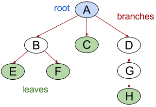
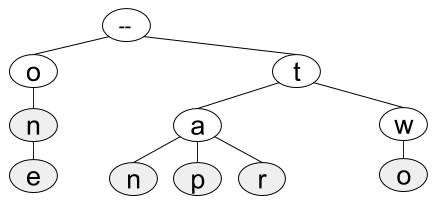

# Trees!

## Introduction/Quick Reference  (10 minutes)

**Graph**

* stores data in vertices (nodes)
* vertices connected by edges that signify relationships or transitions
* edges can be undirected (two-way) or directed (one-way)
* each node usually has a key and often some extra associated data we care about

Operations for a graph:
* given a vertex, find all *adjacent* vertices (nodes it's connected to by an edge)
* given an edge, find the two nodes it connects (and know which is the start node, if the edge is directed)

**Tree**

* type of graph
* rooted (has a single start point)
* edges/branches usually directed (one-way), away from the root
* doesn't allow cycles, or circular paths ("acyclic")
* each node can have only one parent, so only one branch can lead into it

Operations for a tree, with possible method names:
  * access the root node
  * get the key of a given node
  * get an array of all the nodes that are children of a given node

**Binary Search Tree (very common in interviews)**

* kind of tree
* max number of children per node: 2 (this makes it a "binary" tree)
* stores data in an easily sorted order (keys have to be sortable)
* binary search tree property:  
  * left subtree of any node has all keys less than or equal to the node's key (*If it's less, it's to the left!*)  
  * right subtree of any node has all keys greater than or equal to the node's key  
* height with `n` nodes:
	if balanced, `O(log(n))`
	if not balanced, `O(n)`

Operations for a binary search tree:
  * access the root node
  * get the key of a given node
  * get the right child node of a given node (or `None` if there isn't one!)
  * get the left child node of a given node (or `None` if there isn't one)

**Trie**

* kind of tree
* stores sequential data
* each node adds to the sequence
* nodes that are the end of a word or sequence are marked
* height not determined by number of nodes

Operations for a trie:
  * access the root node
  * get the key of a given node
  * given any node, get a boolean which will be true if this node is the end of a word
  * given any node, get an array of all the nodes that are its children

### Today's Challenges

Today's challenges are set up more like what you might encounter in an actual coding interview. We expect you to work in teams of 2 or 3 and do each problem on the whiteboard or the table.  We'll have a very limited time to work on each problem in class, and we'll go over the problems after.  Please do not look at the solutions or look up solutions to these problems online during the drills this morning.

## Challenges

PLEASE DO NOT CODE UNLESS A CHALLENGE SPECIFICALLY INSTRUCTS YOU TO!

### Base Challenges (5 minutes)

Do as many of these challenges as you can in 5 minutes. Don't worry if you don't finish them all.

1. By hand on the whiteboard, create a binary search tree from the following array: [0,1,2,3,4,5,6]. Check that your tree follows the binary search tree property for every subtree: *If it's less, it's to the left.*

1. Create a trie for the following word list: ["hey", "hi", "yo"].

1. How would you add the phrase "hello, govnuh" to your trie from above? (You don't have to draw this all out.)

1. What determines the height of a trie?  

1. How would you find the minimum value in a binary search tree?

1. A "min heap" is another data structure often thought of as a type of binary tree. It has a few additional restrictions, including one called the "min heap property:" every node's key is less than the keys of its children. What is special about the root of a min heap?  

## Binary Search Tree (15 minutes)

**Get as far in this challenge set as you can in 15 minutes.**

Assume for the following challenges that you have a binary search tree data structure. 

1. You run a website where users can assign creative names to colors. You store named colors as nodes in a balanced binary search tree, where the key of a node is a string with the hex code of its color (example keys:  `"#30af99"`, `"#c0ffee"`). Users shouldn't be able to change the name of a color, so your goal is to check if a color is already in the tree.  Pseudocode a `has_key` function to check if a particular hex value is already in the tree.  If the key is in the tree, your function should return `true`. If the key is not in the tree, your function should return `false`. Your function should take the tree and the target hex color key as arguments.

1. Pseudocode an `insert_if_free` function to check if the color exists *and* insert it if it's not already in the tree. If the key is not in the tree, your function should add it to the tree and return `true` (notice this is the reverse of what `has_key` returns).  If the key is already in the tree, your function should return `false`. Your function should take the tree as one argument and the information about the new color as one or more other arguments.  Don't worry about maintaining the balance of the tree; just insert the new node at any valid location.

<!--1. You follow a favorite literary critic's book ratings very closely.  In particular, you keep a self-balancing binary search tree of all the critic's reviews, where each node's key is the rating given by the critic to that node's book.  Every time the critic publishes a new book review, you add it to the tree. Every time you finish reading your current book, you read the next highest-rated book. As a first step to automating your book selection process, pseudocode a `max`function to find the book in the tree with the highest rating. Your function should take the tree as its argument.-->

## Trie (15 minutes)

**Get as far in this challenge as you can in 15 minutes.**

Assume you have a `Trie` data structure.

1. Your frozen yogurt site has a list of flavor options that users can choose from. You've already converted the list of flavors to a trie, but now the frozen yogurt vendor wants to add new flavors. Describe an algorithm to insert a new flavor into the trie. It should existing letter sequences if all or part of the flavor name is already in the tree.

1. Once a user has typed in the first few letters of a flavor, you'd like to be able to suggest the possible full flavor names. (For example, typing "CO" would suggest "coffee", "coconut", and "cookies & cream".) Describe an algorithm you could use to return an array containing all of the flavors in your trie that start with a given letter sequence.

<!--### Tree-->

<!--Assume for the following challenge that you have a tree data structure. As a special bonus operation not always available in trees, you can find the parent of a given node with `.parent` (the parent of the root node is `None`)-->

<!--1. Given the names of two people in a military group, and a tree that represents the military hierarchy, your task is to find the lowest-rank person who commands both of the other people (this excludes the people themselves). If there is no such person, return `None`.  This is often called a  `lowest_common_ancestor` function.-->
