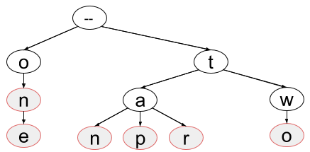

# Trees: Quick Reference

#### Graph

* stores data in vertices (also called nodes)
* vertices are connected by edges, which represent relationships or transitions
* edges can be undirected (two-way) or directed (one-way)
* each node usually has a key and often some extra associated data we care about

Operations for a graph:
* given a vertex, find all *adjacent* vertices (nodes it's connected to by an edge)
* given an edge, find the two nodes it connects (and know which is the start node, if the edge is directed)

Some uses of graphs:
* find routes for visiting multiple cities (nodes are cities; edges are roads)
* social networks (nodes are users; edges represent friendship)
* planning what order to take classes in based on prerequisites (nodes are classes; directed edges represent prerequisite relationship)

#### Tree

* type of graph
* rooted (has a single start point)
* edges/branches usually directed (one-way), away from the root
* doesn't allow cycles, or circular paths ("acyclic")
* each node can have only one parent, so only one branch can lead into it
* time for many operations is related to the *height*

Operations for a tree:
  * access the root node  
  * get the key of a given node
  * get an array of all the nodes that are children of a given node

Some uses of trees:
* the DOM tree for HTML structure
* record possible results of a sequence of decisions in a decision tree
* probability trees for possible results of sequences of random coin flips or dice rolls

#### Binary Search Tree
**very common in interviews**

* kind of tree
* max number of children per node: 2 (this makes it a "binary" tree)
* stores data in an easily sorted order (keys have to be sortable)
* binary search tree property:  
  * left subtree of any node has all keys less than or equal to the node's key (*If it's less, it's to the left!*)  
  * right subtree of any node has all keys greater than or equal to the node's key  
* height with `n` nodes:
  * if balanced, `O(log(n))`  
  * if not balanced, `O(n)`

*A <strong>balanced</strong> binary search tree is as short as it can be - it has "missing children" only on its bottom level and the level right above the bottom. We care because many of the things we like to do with trees take less time if the tree is shorter!*

Operations for a binary search tree:
  * access the root node
  * get the key of a given node
  * get the right child node of a given node (or `None` if there isn't one!)
  * get the left child node of a given node (or `None` if there isn't one)
  

Some uses of binary search trees:
* store data in a sorted order
* accommodate frequent additions and deletions

#### Trie

*Words in this trie: on, one, tan, tap, tar, two*

* kind of tree
* stores sequential data
* each node adds to the sequence
* nodes that are the end of a word or sequence are marked
* height not determined by number of nodes

Operations for a trie:
  * access the root node
  * given any node, get its key
  * given any node, get a boolean that will be true if the node is the end of a word
  * given any node, get an array of all the nodes that are its children
  

Some uses of tries:
 * spell checking
 * autocomplete
  

#### Breadth First Tree Traversal

  * visits nodes in order of how far they are from the start, closest nodes first 
  * doesn't make any assumptions about the relationships among nodes' keys
  * spreads across the graph (or tree) like mold on bread, moving outward from its start location
  * can search for many keys, search by criteria that aren't based on keys, and keep track of depth
  * implemented with a queue to track which node to visit next
 

Some Uses of Breadth First Traversal:
* find all friends-of-friends (in graph)
* check if a binary tree is balanced

#### Depth First Tree Traversal

 * visits nodes by following each path as far (as deep) as it can before going to the next path
 * can search for many keys, search by criteria that aren't based on keys, and keep track of depth
 * implemented with a stack to track which node to visit next, or implemented recursively

Some uses of Depth First Tree Traversal:
* print out all possible sequences of results for 4 coin flips
* find the longest possible path from the root to any leaf in a tree 

