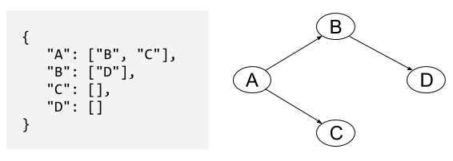

# Tree Practice

Many of these tasks are like what you might encounter in a coding interview. We expect you to work in teams of 2 or 3 and do each problem on the whiteboard or the table.  We'll have a very limited time to work on each problem in class, and we'll go over the problems after.  These tasks are difficult, so please challenge yourself not to look at the solutions or look up solutions online until after you've attempted these tasks in drills.

PLEASE DO NOT CODE UNLESS A PROBLEM SPECIFICALLY INSTRUCTS YOU TO!

### Tree and Binary Search Tree Warmup

1. In an "adjacency list," each node is associated with a list of nodes it has edges going to. Here's an example adjacency list and the tree it represents:

  

  Redraw the graph with this additional information:  `"E": ["C", "D"]`. Is the new graph a tree? If so, which node is the root?

1. By hand on the whiteboard, create a binary search tree from the following array: [0,1,2,3,4,5,6]. Check that your tree follows the binary search tree property for every subtree: *If it's less, it's to the left.*

1. How would you find the minimum value in a binary search tree?

1. A "min heap" is another data structure often thought of as a type of binary tree. It has a few additional restrictions, including one called the "min heap property:" every node's key is less than the keys of its children. What is special about the root of a min heap?  

### Binary Search Tree Tasks

Assume you have a binary search tree data structure.

1. You run a website where users assign creative names to colors. You store the named colors as nodes in a balanced binary search tree. The key of a node is a string with the hex code of its color (example keys:  `"#30af99"`, `"#c0ffee"`). Users shouldn't be able to change the name of a color, so your goal is to check if a color is already in the tree.  

  a) Pseudocode a `has_key` function to check if a particular hex value is already in the tree.  Your function should return `true` if there is a node in the tree with that key, or `false` if there is not. Your function should take the tree and the target hex color key as arguments.

  b) Pseudocode an `insert_if_free` function to check if the color exists *and* insert it if it's not already in the tree. If the key is not in the tree, your function should add it to the tree and return `true` (notice this is the reverse of what `has_key` returns).  If the key is already in the tree, your function should return `false`. Your function should take the tree as one argument and the information about the new color as one or more other arguments.  Don't worry about maintaining the balance of the tree; just insert the new node at any valid location.

1. You keep a self-balancing binary search tree of all book reviews written by your favorite critic. Every time the critic publishes a new book review, you add it to the tree. Every time you finish reading your current book, you remove the book from the tree and read the next highest-rated book.

 a) What will you choose as the key of each node to make it easy to sort the books by their ratings? What is one other value you'd want to store in the node, in addition to the key?

 b) As a first step to automating your book selection process, pseudocode a `max`function to find the book in the tree with the highest rating. Your function should take the tree as its only argument.
 
 
### Tree Tasks

Assume you have a tree data structure. As a special bonus operation not always available in trees, you can find the parent of a given node with `.parent` (the parent of the root node is `None`)

1. Given the names of two people in a military group, and a tree that represents the military hierarchy, your task is to find the lowest-rank person who commands both of the other people (this excludes the people themselves). If there is no such person, return `None`.  This is often called a  `lowest_common_ancestor` function.

 

### Trie Warmup

1. Create a trie for the following word list: ["hey", "hi", "yo"].

1. How would you add the phrase "hello, govnuh" to your trie from above?

1. What determines the height of a trie?  

### Trie Tasks

Assume you have a trie data structure.

1. Your frozen yogurt site has a list of flavor options that users can choose from. You've already converted the list of flavors to a trie, but now the frozen yogurt vendor wants to add new flavors. Describe an algorithm to insert a new flavor into the trie. It should use existing letter sequences (instead of adding duplicate nodes) if all or part of the flavor name is already in the tree.

1. Once a user has typed in the first few letters of a flavor, you'd like to be able to suggest the possible full flavor names. (For example, typing "CO" would suggest "coffee", "coconut", and "cookies & cream".) Describe an algorithm you could use to return an array containing all of the flavors in your trie that start with a given letter sequence.

