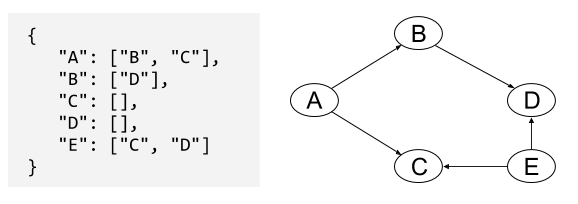

# Tree Practice Solutions

**Please challenge yourself not to look at solutions until after you've attempted these tasks in drills!**

**PLEASE DO NOT CODE UNLESS A TASK SPECIFICALLY INSTRUCTS YOU TO!**

### Tree and Binary Search Tree Warmup


1. In an "adjacency list," each node is associated with a list of nodes it has edges going to. Here's an example adjacency list and the tree it represents:

  

  Redraw the graph with this additional information:  `"E": ["C", "D"]`. Is the new graph a tree? If so, which node is the root?
  <details><summary>click for solution</summary>
  
  
  This graph is *not* a tree. It has nodes with two parents (C and D). It doesn't have a single source node (root).
  </details>

1. By hand on the whiteboard, create a binary search tree from the following array: [0,1,2,3,4,5,6]. Check that your tree follows the binary search tree property for every subtree: *If it's less, it's to the left.*

	<details><summary>click for solution</summary>
	A balanced solution:
	
  
  ---
  An unbalanced solution:
  
  
	</details>

1. How would you find the minimum value in a binary search tree?

	<details><summary>click for solution</summary>
	Follow the left path from the root until you can't go left any more! (Convince yourself this works.)
	</details>

1. A "min heap" is another data structure often thought of as a type of binary tree. It has a few additional restrictions, including one called the "min heap property:" every node's key is less than the keys of its children. What is special about the root of a min heap?  

	<details><summary>click for solution</summary>
	The root node of a min heap is the minimum element!  There's a similar data structure called a "max heap". Heaps are awesome in their own right!
	</details>

### Binary Search Tree Tasks

Assume you have a binary search tree data structure.

1. You run a website where users assign creative names to colors. You store the named colors as nodes in a balanced binary search tree. The key of a node is a string with the hex code of its color (example keys:  `"#30af99"`, `"#c0ffee"`). Users shouldn't be able to change the name of a color, so your goal is to check if a color is already in the tree.  

  a) Pseudocode a `has_key` function to check if a particular hex value is already in the tree.  Your function should return `true` if there is a node in the tree with that key, or `false` if there is not. Your function should take the tree and the target hex color key as arguments.
  
  <details><summary>click for solution</summary>
	
   ```python
   def has_key(tree, key):
     # start at root
     current_node = tree

     # go down the tree until we can't any more
     while current_node is not None:

       # each time we go down, move left if we're looking for a smaller key...
       if current_node.key > key:
         current_node = current_node.left
       # ... or move right if we're looking for a larger key
       else if current_node.key < key:
         current_node = current_node.right
       # ... or if we've found the key, we're done!
       else:
         return true

     # if we get to the bottom without finding our key,
     # it must not be in the tree
     return false
  ```

	</details>

  b) Pseudocode an `insert_if_free` function to check if the color exists *and* insert it if it's not already in the tree. If the key is not in the tree, your function should add it to the tree and return `true` (notice this is the reverse of what `has_key` returns).  If the key is already in the tree, your function should return `false`. Your function should take the tree as one argument and the information about the new color as one or more other arguments.  Don't worry about maintaining the balance of the tree; just insert the new node at any valid location.
  
  <details><summary>click for solution</summary>
	```python
    def insert_if_free(tree, key):
        # start at root
        current_node = tree

        while current_node is not None:

            if current_node.key == key:
                # key is already in tree
                return false

            else if current_node.key > key: # need to go left for lesser keys
                if current_node.left is not None:
                    current_node = current_node.left
                else:
                    # if there is no left child, safe to insert new node here
                    current_node.left = new BinarySearchTree(key, new_node_data)
                    return true
            else:  # means current_node.key < key, need to go right for higher keys
                if current_node.right is not None:
                    current_node = current_node.right
                else:
                    current_node.right = new BinarySearchTree(key, new_node_data)
                    return true
  ```
	</details>

1. You keep a self-balancing binary search tree of all book reviews written by your favorite critic. Every time the critic publishes a new book review, you add it to the tree. Every time you finish reading your current book, you remove the book from the tree and read the next highest-rated book.

 a) What will you choose as the key of each node to make it easy to sort the books by their ratings? What is one other value you'd want to store in the node, in addition to the key?
 
 <details><summary>click for solution</summary>
 
 </details>

 b) As a first step to automating your book selection process, pseudocode a `max`function to find the book in the tree with the highest rating. Your function should take the tree as its only argument.
 
 <details><summary>click for solution</summary>
 ```python
  def max(tree):

    current_node = tree
    while current_node.right is not None:
      current_node = current_node.right
    return current_node
  ```
 </details>
 
1. For the book priority problem above, how does using a binary search tree compare to using a sorted array?  Does it matter whether the binary search tree is balanced?

	<details><summary>click for an answer</summary>
	
  There are three main things we need to be able to do for this problem: find the highest-rated (max key) book, insert new books in the correct sorted location in the data structure, and delete the highest-rated book once we've decided to read it.

  With a sorted array, finding max and deleting max are both O(1) time assuming the array tracks its length. When we want to insert a book by rating, we can use binary search to find where it belongs in O(log n) time. However, inserting it into the array will be O(n) because every element after the insertion point will have to move over one.

  To find the max in a binary search tree, we have to start at the root and follow a path all the way down to the rightmost node in the tree. So the number of nodes we look at could be up to the height of the tree.  A non-balanced binary search tree would still potentially have us looking at all `n` values if it's just a chain of nodes.  But, with a balanced binary search tree, the height will be O(log<sub>2</sub>n).  Inserting into the binary search tree is also O(log<sub>2</sub>n).  Deleting the max node, as a separate operation, would require us to find it again at O(log<sub>2</sub>n) time cost. If we do in the same pass through the tree as when we find the max, though, we can delete in O(1) extra time.

  The choice whether to use a balanced binary search tree or a sorted array boils down to which kind of operation we'll do more often. If books are going to be inserted far more quickly than we can read them, maybe we'd don't want to pay the potentially O(n) cost to insert into a sorted array. On the other hand, if books are inserted at a slower pace, or if we're worried about O(n) being too long to wait for any one operation, it could make sense to go with a self-balancing binary search tree and pay the O(log n) cost for every operation.
  </details>

### Tree Tasks


Assume you have a tree data structure. As a special bonus operation not always available in trees, you can find the parent of a given node with `.parent` (the parent of the root node is `None`)

1. Given the names of two people in a military group, and a tree that represents the military hierarchy, your task is to find the lowest-rank person who commands both of the other people (this excludes the people themselves). If there is no such person, return `None`.  This is often called a  `lowest_common_ancestor` function.

 <details><summary>click for solution</summary>
  ```python

  def lowest_common_ancestor(node1, node2):
    # we'll track two nodes here, and keep a list of their anscestors
    # working up from our nodes until we find one in common
    current1 = node1
    current2 = node2
    node1_ancestors = set()  # a set is a list that doesn't allow duplicates; can be simulated with a hash
    node2_ancestors = set()  # we'll pretend the set() function creates a new empty set

    while current1.parent is not None and curent2.parent is not None:
      # move up the tree on node1's side and check if we've found a common ancestor
      current1 = current1.parent
      if current1 in node2_ancestors:
        return current1
      else:
        node1_ancestors.add(current1)

      # move up the tree on node2's side and check if we've found a common ancestor
      current2 = current2.parent
      if current2 in node1_ancestors:
        return current2
      else:
        node2_ancestors.add(current2)

    # after the while loop, we've reached a point
    # where we can't move up any further on one side
    # (on one side, at least, we're at the root!)


    # check any remaining nodes between current1 and the root
    while current1.parent is not None
      current1 = current1.parent
      if current1 in node2_ancestors:
        return current1

    # check any remaining nodes between current2 and the root
    while current2.parent is not None
      current2 = current2.parent
      if current2 in node1_ancestors:
        return current2

    # if we haven't found anything in common yet, we aren't going to
    return None
  ```

 </details>

<br>
<hr>

### Trie Warmup

1. Create a trie for the following word list: ["hey", "hi", "yo"].

  <details><summary>click for solution</summary>
 	
  </details>

1. How would you add the phrase "hello, govnuh" to your trie from above?

  <details><summary>click for solution</summary>
  	
  </details>
  
1. What determines the height of a trie?  

  <details><summary>click for solution</summary>
   The length of the longest sequence/word/phrase.
   
   There are a few space-saving tree variants based on tries that let the tree be a bit shorter. One straightforward version, called a radix tree, merges chains of nodes that are their parent's only child -- each resulting node could be a single letter or a chunk of letters. For the example above, a radix tree with "hello, guvnuh would share the `H` and `E` nodes, then have a `LLO, GUVNAH` node as a child of the `E`.
  </details>

### Trie Tasks


Assume you have a trie data structure.

1. Your frozen yogurt site has a list of flavor options that users can choose from. You've already converted the list of flavors to a trie, but now the frozen yogurt vendor wants to add new flavors. Describe an algorithm to insert a new flavor into the trie. It should use existing letter sequences (instead of adding duplicate nodes) if all or part of the flavor name is already in the tree.

  <details><summary>click for solution</summary>
  
 ```python
      def insert(trie, word):
          # start with the current node at the root of the trie   
          current_node = trie
          # keep track of what index we're at in the string flavor   
          i = 0

          while i < word.length:

              # if the next letter in the flavor is one of the current node's children   
              if word[i] in current_node.children:
                  # make that child the current node and increase our index in string
                  index = current_node.children.index(word[i])
                  current_node = current_node.children[index]  
                  i = i + 1

              # if the next letter in the flavor is not one of the current node's children   
              else:
                  # add a new node with that letter as a child of the current node  
                  new_node = Trie(word[i])
                  current_node.children.append(new_node)

                  # make that child the current node  and increase the index in the flavor string
                  current_node = new_node   
                  i = i + 1

          # once we have no more letters to go (after while loop):   
          # mark the current node as the end of a word   

          current_node['end_of_word'] = true
  ```

  </details>

1. Once a user has typed in the first few letters of a flavor, you'd like to be able to suggest the possible full flavor names. (For example, typing "CO" would suggest "coffee", "coconut", and "cookies & cream".) Describe an algorithm you could use to return an array containing all of the flavors in your trie that start with a given letter sequence.

  <details><summary>click for solution</summary>
	```
  * function will take in the trie, and the array of letters typed so far  (e.g., ["c", "o"])
  * check that the already-typed sequence of letters is in the trie
  * find the node that corresponds to the last letter in that sequence
  * starting with that letter as the root, use depth first search to find all the words in 
  		 the sub-tree (e.g., ["conut", "ffee", "okies & cream"])
  * add the typed in letters to each word found, and output the list of full words  
  		 (["coconut", "coffee", "cookies & cream"])
  ``` 
  </details>


